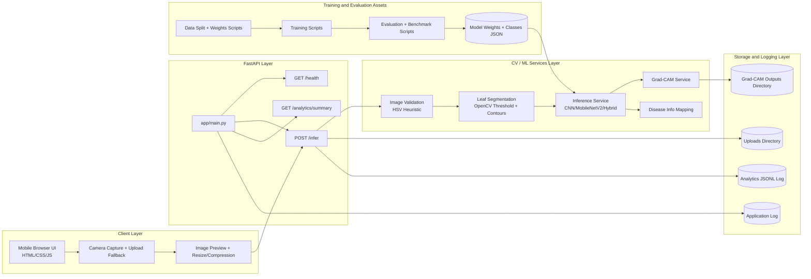

# Full System Architecture

This architecture summarizes the production-oriented prototype layers and interfaces.

## Layer Responsibilities
- Client Layer: acquisition and lightweight preprocessing for bandwidth efficiency.
- FastAPI Layer: endpoint orchestration and response formatting.
- CV/ML Layer: validation, segmentation, classification, and explainability.
- Storage/Logging Layer: traceability of inputs, outputs, and runtime analytics.
- Offline Assets: reproducible training/evaluation pipeline and deployable model artifacts.
