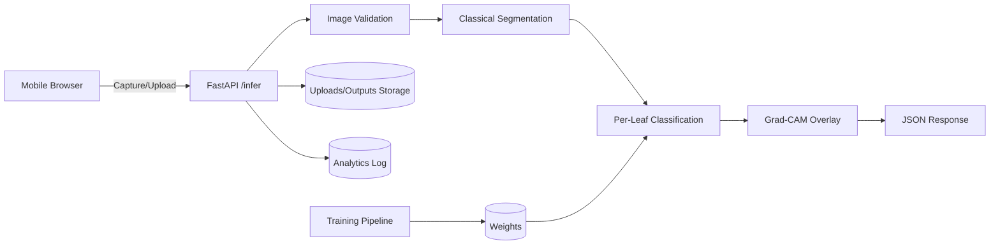

# System Architecture

## Components
- Mobile Browser Frontend (camera capture, upload fallback, preview, compression)
- FastAPI Backend (validation, segmentation, inference, Grad-CAM, analytics)
- ML Layer (PyTorch models and training/evaluation scripts)
- Storage Layer (`app/static/uploads`, `app/static/outputs`, `logs/analytics.jsonl`)

## Architecture Diagram

