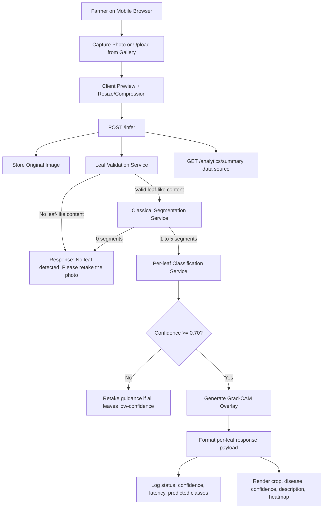

# System Flow Diagram

This flow documents the complete user-to-result inference path used in the deployed prototype.

## Runtime Behavior Notes
- Max leaves processed per image: 5
- Low-confidence predictions are not force-assigned
- Mixed outcomes are supported (healthy and diseased leaves in one image)
- Response includes per-leaf explainability artifacts (Grad-CAM heatmaps)
