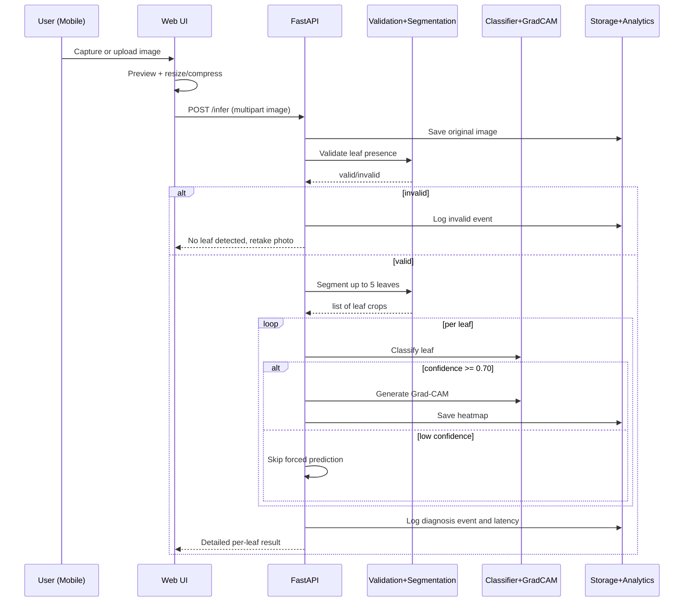

# System Flow Diagram

```mermaid
sequenceDiagram
  participant U as User (Mobile)
  participant W as Web UI
  participant API as FastAPI
  participant CV as Validation+Segmentation
  participant ML as Classifier+GradCAM
  participant S as Storage+Analytics

  U->>W: Capture or upload image
  W->>W: Preview + resize/compress
  W->>API: POST /infer (multipart image)
  API->>S: Save original image
  API->>CV: Validate leaf presence
  CV-->>API: valid/invalid
  alt invalid
    API->>S: Log invalid event
    API-->>W: No leaf detected, retake photo
  else valid
    API->>CV: Segment up to 5 leaves
    CV-->>API: list of leaf crops
    loop per leaf
      API->>ML: Classify leaf
      alt confidence >= 0.70
        API->>ML: Generate Grad-CAM
        API->>S: Save heatmap
      else low confidence
        API->>API: Skip forced prediction
      end
    end
    API->>S: Log diagnosis event and latency
    API-->>W: Detailed per-leaf result
  end
```
